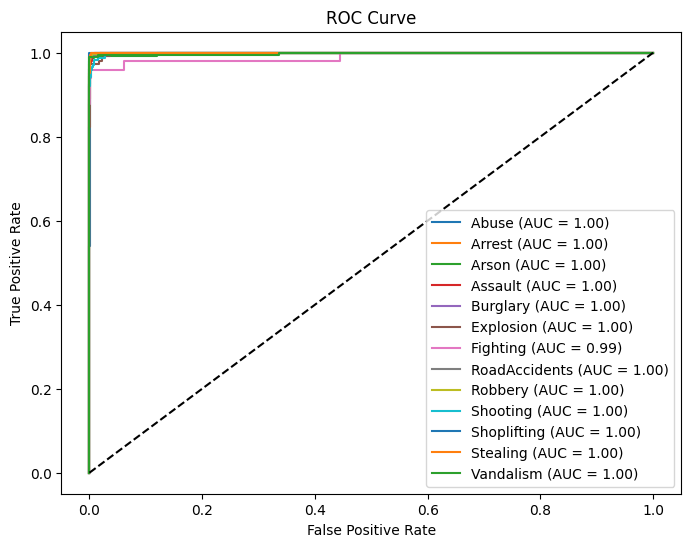

# Suspicious Activity Detection

## Overview
This project aims to detect suspicious activities in video footage using a **CNN-LSTM model**. The model is trained to classify video frames into different categories of suspicious activities (e.g., shoplifting, abuse, etc.). The project includes data preprocessing, model training, evaluation, and prediction scripts.

---

## Table of Contents
1. [Features](#features)
2. [Installation](#installation)
3. [Usage](#usage)
4. [Dataset](#dataset)
5. [Model Architecture](#model-architecture)
6. [Results](#results)
7. [Contributing](#contributing)
8. [License](#license)

---

## Features
- **Video Preprocessing**: Extracts frames from videos and resizes them for model input.
- **CNN-LSTM Model**: Combines Convolutional Neural Networks (CNNs) for spatial feature extraction and Long Short-Term Memory (LSTM) networks for temporal modeling.
- **Training and Evaluation**: Includes scripts for training the model and evaluating its performance.
- **Prediction**: Allows users to classify new videos using the trained model.

---

## Installation
To set up the project, follow these steps:

1. **Clone the Repository**:
   ```bash
   git clone https://github.com/GracyBandaru/Suspicious_Activity_Detection.git
   cd Suspicious_Activity_Detection
   ```

2. **Install Dependencies**:
   Ensure you have Python 3.8 or higher installed. Then, install the required libraries:
   ```bash
   pip install -r requirements.txt
   ```

3. **Download the Dataset**:
   Place your dataset in the `dataset` folder. The dataset should contain videos organized by class (e.g., Abuse, Shoplifting).

---

## Usage

### 1. Preprocessing
To preprocess the dataset (extract frames and resize them):
```bash
python preprocess.py --dataset_path /path/to/dataset --output_path /path/to/output
```

### 2. Training
To train the CNN-LSTM model:
```bash
python train.py --dataset_path /path/to/preprocessed_data --model_path /path/to/save_model
```

### 3. Evaluation
To evaluate the model on the test set:
```bash
python evaluate.py --model_path /path/to/model --test_data_path /path/to/test_data
```

### 4. Prediction
To classify a new video:
```bash
python predict.py --model_path /path/to/model --video_path /path/to/video
```

---

## Dataset
The dataset used for this project is the **DCSASS Dataset**, which contains videos of various suspicious activities. The dataset is organized as follows:

```
dataset/
├── Abuse/
│   ├── Abuse001.mp4
│   ├── Abuse002.mp4
│   └── ...
├── Shoplifting/
│   ├── Shoplifting001.mp4
│   ├── Shoplifting002.mp4
│   └── ...
└── ...
```

---

## Model Architecture
The model architecture consists of:

- **CNN Layers**: For spatial feature extraction from video frames.
- **LSTM Layers**: For temporal modeling of frame sequences.
- **Dense Layers**: For classification.

```python
model = Sequential([
    TimeDistributed(Conv2D(16, (3, 3), activation='relu'), input_shape=(max_frames, img_size[0], img_size[1], 1)),
    TimeDistributed(MaxPooling2D((2, 2))),
    TimeDistributed(Conv2D(32, (3, 3), activation='relu')),
    TimeDistributed(MaxPooling2D((2, 2))),
    TimeDistributed(Flatten()),
    LSTM(64, return_sequences=False),
    Dense(32, activation='relu'),
    Dense(num_classes, activation='softmax'),
])
```

---

## Results
- **Accuracy**: 97% on the test set.


**ROC Curve:**


---

## Contributing
Contributions are welcome! If you'd like to contribute, please follow these steps:

1. **Fork the repository.**
2. **Create a new branch** (`git checkout -b feature/YourFeature`).
3. **Commit your changes** (`git commit -m 'Add some feature'`).
4. **Push to the branch** (`git push origin feature/YourFeature`).
5. **Open a pull request**.

---

## License
This project is licensed under the **MIT License**. See the LICENSE file for details.

---

## Contact
For questions or feedback, please contact:

- **Gracy Bandaru**
- **Email**: gracy.bandaru@example.com
- **GitHub**: [GracyBandaru](https://github.com/GracyBandaru)

---

### **How to Use**
1. Copy the entire content above.
2. Paste it into a file named `README.md` in the root of your project directory.
3. Replace placeholders (e.g., dataset paths, accuracy, contact info) with actual values.
4. Add images (e.g., confusion matrix, ROC curve) to the repository and link them in the README.

---

### **Adding Images**
If you have a confusion matrix saved as `confusion_matrix.png`, add it to the repository and link it in the README like this:

```markdown

```

Similarly, for the ROC curve:

```markdown

```

Let me know if you need further assistance! 🚀

